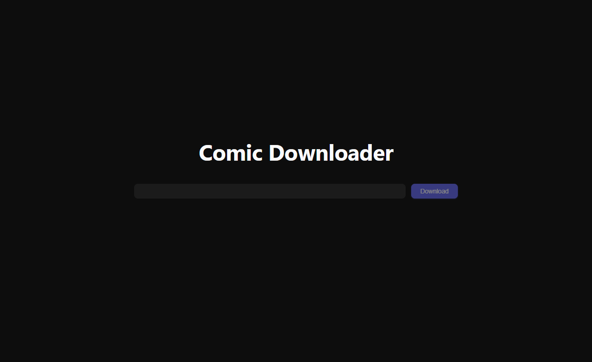
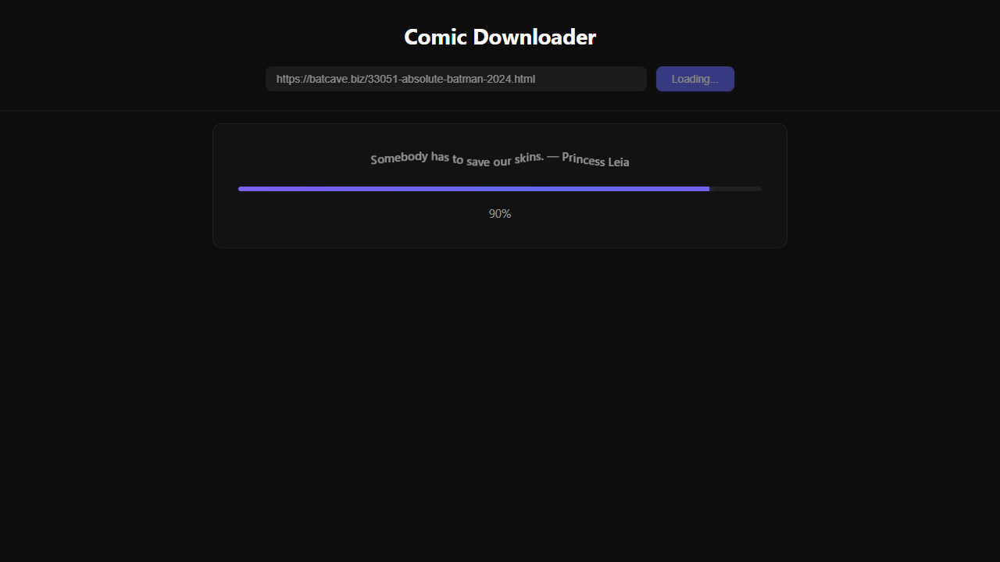
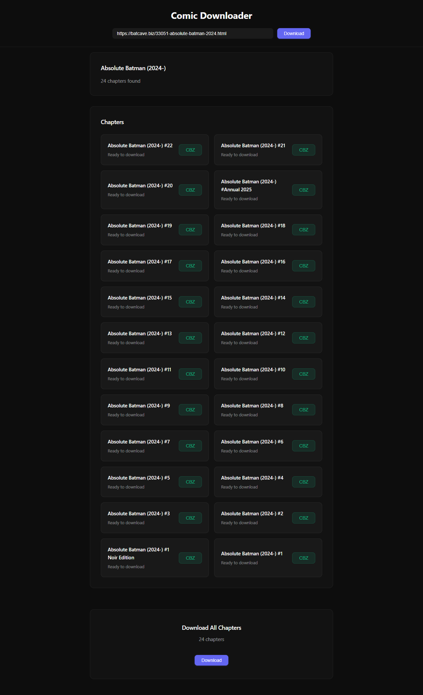

# Comic Downloader

> A web app for downloading comics as CBZ archives. Built with React + Node.js + Puppeteer.

[](https://render.com)
[](https://react.dev)
[](https://nodejs.org)

---

## Screenshots

| Home | Scraping | Results |
|------|----------|---------|
|  |  |  |

---

## What It Does

Paste a comic URL, get a structured CBZ file. The backend scrapes the chapter list, downloads each page as an image, and bundles everything into a single archive organized by chapter.

**Supported formats:**

- **CBZ** (ZIP with `.cbz` extension) — one archive per chapter, or a master archive with all chapters
- Images organized in folders by chapter name

---

## Tech Stack

| Layer | Technology |
|-------|-----------|
| Frontend | React 18 + Vite |
| Backend | Node.js + Express |
| Scraping | Puppeteer (headless Chrome) |
| Archive | JSZip |
| Hosting | Render (backend) + GitHub Pages / Vercel (frontend) |

---

## Architecture

```
┌─────────────┐      REST API       ┌─────────────────┐
│   React     │ ◄─────────────────► │   Node/Express  │
│  (Vite)     │   /api/scrape       │   Puppeteer     │
│             │   /api/scrape-chapter│   JSZip         │
└─────────────┘                     └─────────────────┘
                                           │
                                           ▼
                                    ┌─────────────┐
                                    │  Headless   │
                                    │   Chrome    │
                                    └─────────────┘
```

---

## Local Development

### Prerequisites

- Node.js 18+
- Chrome/Chromium (for Puppeteer)

### 1. Clone & Install

```bash
git clone https://github.com/AfroPK/comic-downloader-web.git
cd comic-downloader-web

# Install backend
cd backend && npm install

# Install frontend
cd ../frontend && npm install
```

### 2. Environment Variables

Create `backend/.env`:

```env
# Required: which sites are allowed
TARGET_SITES=https://example-site.com

# Optional: proxy for scraping
PROXY_HOST=your-proxy-host:port
PROXY_USERNAME=your-username
PROXY_PASSWORD=your-password
```

### 3. Run

```bash
# Terminal 1: Backend
cd backend
npm start

# Terminal 2: Frontend
cd frontend
npm run dev
```

The frontend will proxy API requests to `http://localhost:3000`.

---

## Deployment

### Backend (Render)

1. Connect your GitHub repo to [Render](https://render.com)
2. Create a Web Service with:
   - **Root Directory:** `backend`
   - **Build Command:** `npm install`
   - **Start Command:** `npm start`
   - **Environment Variables:**
     - `TARGET_SITES` — comma-separated list of allowed sites
     - `NODE_ENV=production`

A `render.yaml` is included for blueprint deployment.

### Frontend (GitHub Pages / Vercel)

**GitHub Pages:**

```bash
cd frontend
npm run build
# Deploy the `dist/` folder to GitHub Pages
```

Update `vite.config.js`:
- For GitHub Pages: `base: '/comic-downloader-web/'`
- For custom domain: `base: '/'`

**Vercel:**

Connect the repo and set the root directory to `frontend`.

---

## Environment Variables

| Variable | Required | Description |
|----------|----------|-------------|
| `TARGET_SITES` | Yes | Comma-separated list of allowed comic sites |
| `PROXY_HOST` | No | Proxy server for scraping |
| `PROXY_USERNAME` | No | Proxy auth username |
| `PROXY_PASSWORD` | No | Proxy auth password |
| `PUPPETEER_EXECUTABLE_PATH` | No | Custom Chrome path |

---

## Project Structure

```
comic-downloader-web/
├── backend/
│   ├── src/
│   │   ├── server.js              # Express API
│   │   ├── scrape.js              # Generic comic scraper
│   │   ├── scrape-chapter.js      # Generic chapter scraper
│   │   ├── download-full.js         # Full comic download (single browser, disk-based)
│   │   ├── scrapers/
│   │   │   └── xoxocomic.js       # Site-specific scraper
│   │   └── config.js              # Site allowlist
│   └── package.json
├── frontend/
│   ├── src/
│   │   ├── App.jsx
│   │   ├── hooks/
│   │   │   └── useScrape.js       # Scraping state management
│   │   └── components/
│   │       ├── ComicForm.jsx      # URL input
│   │       ├── ChapterList.jsx    # Chapter grid
│   │       └── FullDownloadSection.jsx
│   └── package.json
└── render.yaml                    # Render blueprint
```

---

## How Scraping Works

1. **Comic page** — Puppeteer navigates to the URL, extracts the chapter list
2. **Chapter pages** — For each chapter, Puppeteer loads the reader page and extracts image URLs
3. **Image download** — Images are fetched directly (not through browser) with proper cookies/referer
4. **Archiving** — Images are written to disk as binary files, then bundled into CBZ/ZIP
5. **Cleanup** — Temporary files are deleted after the archive is created

The full-download endpoint uses a single browser instance across all chapters to minimize memory usage.

---

## Disclaimer

**This tool is for personal use and educational purposes only.**

- **Not affiliated with** any comic hosting site.
- **Not affiliated with** Batcave, XoxoComic, or any other third-party platform.
- Respect the terms of service of any site you use this with.
- Only use this on sites you have permission to access.
- The authors assume no liability for misuse.

---

## License

MIT

---

<p align="center">
  Built with ⚡ by <a href="https://github.com/AfroPK">AfroPK</a>
</p>
