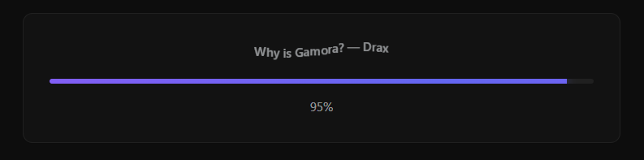

# Comic Downloader Web

> A local-only web application for downloading comics as clean CBZ archives.



---

## 🛑 Prerequisites

Before running Comic Downloader Web, ensure you have the following installed on your system:

1. **Node.js (v18 or higher)** and npm.
2. **Google Chrome, Microsoft Edge, or Brave Browser** installed (required for Puppeteer headless browser scraping and anti-bot evasion).
3. **Site Support**: Currently, **`batcave`** is the only fully supported site that works at the moment.

---

## 📖 Step-by-Step Guide: How to Download Comics

Follow these exact steps to configure, run, and use Comic Downloader Web.

---

### Step 1: Configure Allowed Target Sites
Before downloading any comic, you must explicitly allow the domain in your environment settings for security.

1. Navigate to your project folder and open `backend/.env` in any text editor.
2. Set the `TARGET_SITES` variable to include your target comic website domain(s) (comma-separated, no spaces).

```env
PORT=3000
TARGET_SITES=https://example-comic-site.com
```

> **Important:** No websites are allowed by default. If you try to download a URL not listed in `TARGET_SITES`, the app will return a `URL not allowed` error.

---

### Step 2: Start the Backend & Frontend
Launch the application locally on your machine.

- **Windows:**
  - Double-click `setup.bat` (first time only to install dependencies).
  - Double-click `run.bat` to start the app.
- **Linux / Mac:**
  - Run `./setup.sh` (first time only).
  - Run `./run.sh` to start the app.

This automatically spins up the Express backend server (`http://localhost:3000`) and the Vite React frontend (`http://localhost:5173`).

---

### Step 3: Open the Web Interface & Paste URL
1. Open your web browser and go to:
   ```text
   http://localhost:5173
   ```
2. In the input bar at the top, paste the full URL of the comic you wish to download (e.g., `https://example-comic-site.com/comic-name`).

---

### Step 4: Download Chapters or Full Comic
1. Click the **Download** button.
2. Wait for the app to extract chapters and metadata.
3. Once chapters load, select individual chapters to download as `.cbz` files or click **Download Full Comic** to compile everything into a single master `.zip` archive complete with a summary report.

---

## ⚙️ Troubleshooting

- **"URL not allowed"** — Add your target site's domain to `TARGET_SITES` in `backend/.env`.
- **"Puppeteer cannot launch"** — Ensure Google Chrome, Microsoft Edge, or Brave Browser is installed. If installed in a custom location, specify `PUPPETEER_EXECUTABLE_PATH` in `backend/.env`.

---

## 📜 Disclaimer

**For personal use and educational purposes only.** Respect the terms of service of any site you access.

---

## 🛡️ License

MIT
